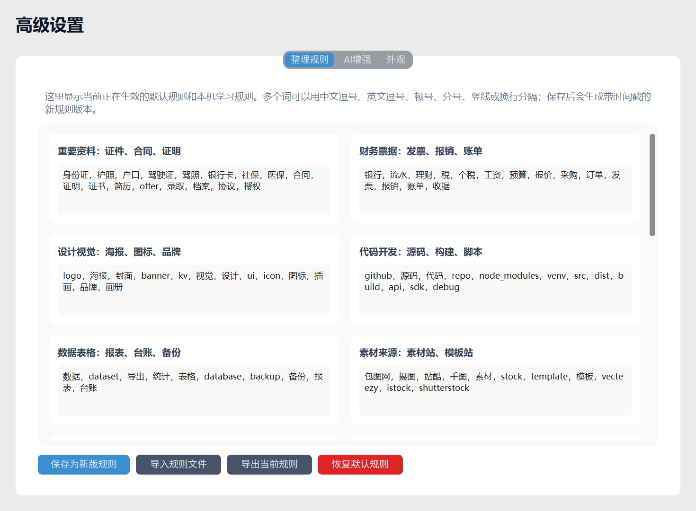

# 科学文件整理器

科学文件整理器是一款面向普通用户的 Windows 桌面文件整理工具。它不是简单按照扩展名把文件分堆，而是综合文件用途、来源、时间、项目关联、文件夹结构、媒体元数据和规则库，先生成可检查的整理方案，再安全执行归档。


## 适合谁

- 下载目录、桌面、聊天软件接收文件夹长期混乱的人
- 经常处理 Word、Excel、PPT、PDF、图片、视频、音频和压缩包的办公用户
- 有大量 AI 生成图、设计素材、剪辑素材、代码项目、3D/CAD 模型的创作者
- 想定期整理资料，但又担心误移动文件的人

## 核心特点

- **先预览，后整理**：执行前会显示每个项目的建议位置、可信度和判断依据。
- **不是粗暴按类型分类**：优先按业务场景、文件来源、项目关系和时间线判断。
- **支持续整理**：可以继续整理到已有归档，并自动更新归档截止日期。
- **支持日期范围**：可以只整理某个日期之前的旧内容。
- **支持恢复记录**：每次整理会生成恢复记录，可以按记录回退。
- **规则可视化**：高级设置里可以查看、修改、导入、导出当前生效规则。
- **AI 增强可选**：默认关闭；填写自己的模型接口和 Key 后，可让 AI 复核低可信结果并沉淀成本机规则。
- **本机安全保存**：API Key 使用 Windows 本机能力加密保存。

## 分类能力

### 办公文件

可细分合同协议、财务报销、会议纪要、方案计划、项目资料、报表台账、客户销售订单、课件培训、PPT 汇报、表格清单等场景。

### 媒体素材

可细分 AI 生成图、相机照片、截图、平台下载图片、修图导出图片、录屏视频、剪辑导出视频、DJI/GoPro/手机拍摄视频、录音、语音备忘和音乐音效素材。

### 其他资料

支持设计源文件、字体、3D/CAD 模型、剪辑工程、字幕调色文件、代码项目、脚本配置、软件安装包、压缩包、邮件、电子书、数据导出文件等。

## 使用方式

1. 启动软件。
2. 点击“选择”，选中要整理的文件夹。
3. 选择整理方式和日期范围。
4. 根据需要决定是否开启“包含子文件夹”。
5. 点击“预览”，检查整理清单。
6. 确认无误后点击“执行整理”。
7. 如需回退，点击“恢复记录”。

## 高级设置



高级设置包含三部分：

- **整理规则**：查看和编辑当前生效规则，保存后会生成带时间戳的新版本。
- **AI 增强**：配置 OpenAI 兼容接口，测试连接，刷新模型列表。
- **外观**：浅色、深色或跟随系统。

## AI 增强说明

AI 增强默认关闭。开启后，程序会先用本地规则生成分类方案，再把低可信或待确认项目交给 AI 复核。AI 修正中较稳定、较通用的结果会沉淀到本机规则里，让软件越用越贴合用户习惯。

AI 复核只发送文件名、父级路径提示、扩展名、当前分类和判断理由，不读取文件正文内容。

## 从源码运行

```bash
pip install -r requirements.txt
python smart_file_organizer.py
```

## 打包为 exe

```bash
pyinstaller --noconfirm --clean --onefile --windowed --collect-data customtkinter --add-data "rules.json;." --name "科学文件整理器" smart_file_organizer.py
```

## 规则文件

- `rules.json`：默认通用规则，适合开源和分享。
- `rules.local.json`：本机私人规则，默认被 `.gitignore` 忽略，不建议提交。
- `rules.local.example.json`：私人规则示例。

## 用户说明书

仓库中包含 Word 版用户说明书：

- `科学文件整理器_用户使用说明.docx`

## 许可证

本项目使用 MIT License。
